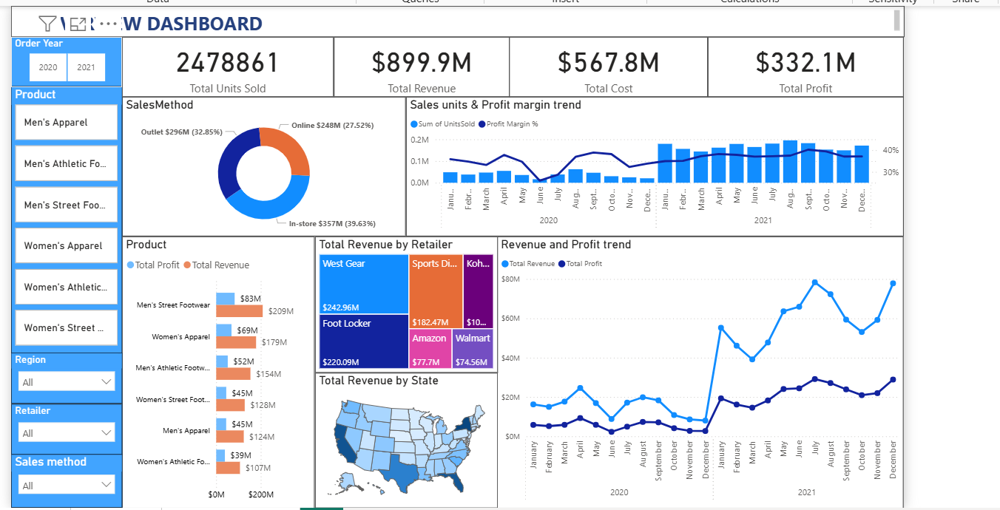
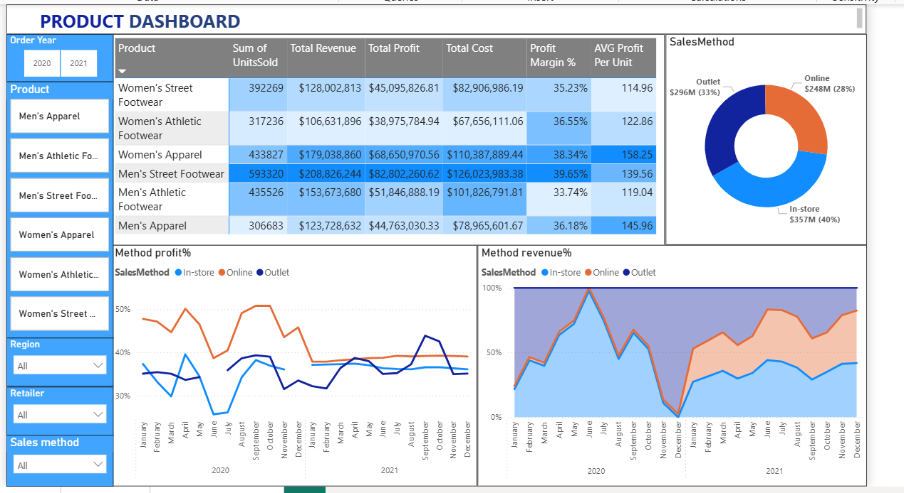
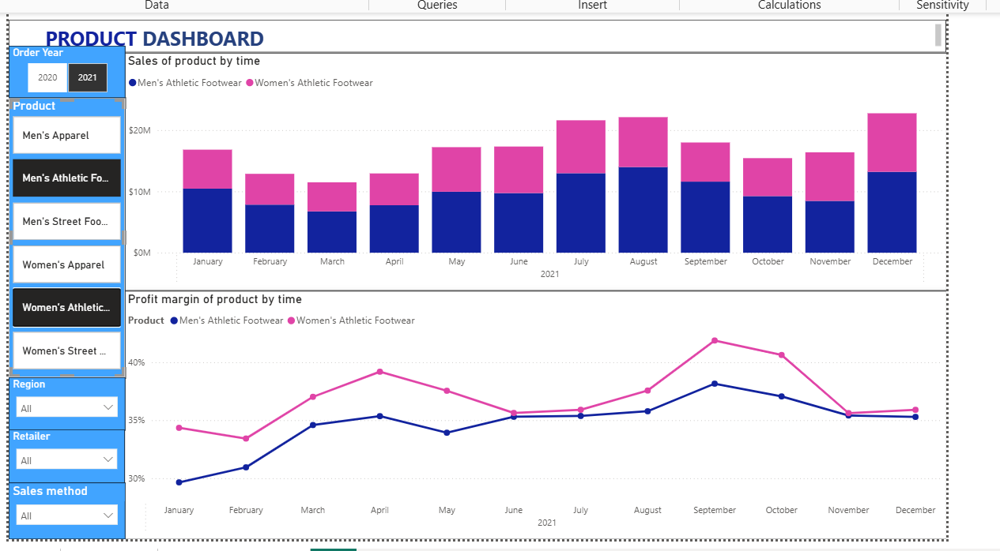
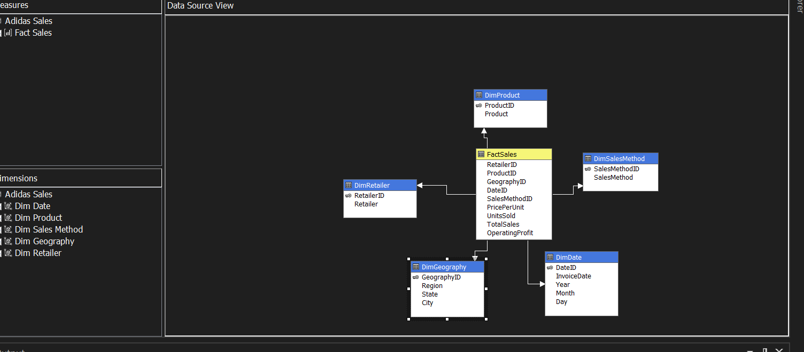

# 📊 Sales Analysis for Adidas (SSIS - SSAS - Power BI - SQL)

---

## 🚀 Mục tiêu dự án

Phân tích dữ liệu bán hàng của Adidas nhằm:
- Tìm hiểu xu hướng kinh doanh theo thời gian, khu vực, kênh phân phối
- Đánh giá hiệu quả bán hàng theo sản phẩm và nhà bán lẻ
- Hỗ trợ ra quyết định nhờ hệ thống báo cáo trực quan & mô hình phân tích OLAP

---

## 🧰 Công nghệ & công cụ sử dụng

| Công cụ        | Mục đích sử dụng                            |
|----------------|---------------------------------------------|
| **SQL Server** | Lưu trữ và truy vấn dữ liệu                 |
| **SSIS**       | ETL: Trích xuất, chuyển đổi, nạp dữ liệu    |
| **SSAS**       | Tạo mô hình OLAP, dimensions & cubes        |
| **Power BI**   | Trực quan hóa dữ liệu, xây dựng dashboard   |
| **T-SQL**      | Viết truy vấn phân tích dữ liệu             |

---

## 📁 Cấu trúc thư mục
Sale_analysis_adidas/
├── SSIS/ # Gói ETL trong SSIS
├── SSAS/ # Mô hình phân tích OLAP
├── SOURCES DATA/ # Dữ liệu nguồn đầu vào
├── SalesDashboard.pbix # Dashboard Power BI
├── SQL QUERY.sql # Truy vấn phân tích

---

## 📸 Một số ảnh minh họa
### 📊 Power BI Dashboard

### 🧱 Mô hình Cube trong SSAS

